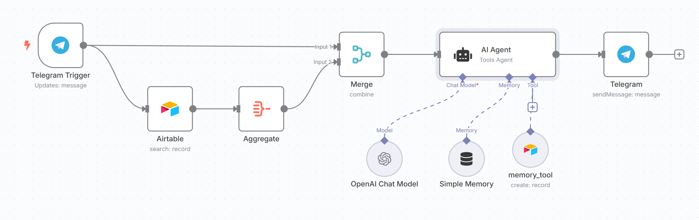

# 🤖 Telegram Memory AI Bot (n8n + Airtable + OpenAI)

This project is an **AI-powered Telegram chatbot** built using [n8n](https://n8n.io/), with **persistent memory** stored in **Airtable**, and powered by **OpenAI GPT-4o-mini**.

The bot uses a LangChain Agent to process natural language inputs, recall user-specific "memories", and respond in a conversational, friendly tone — while continuing to learn from each conversation.

---

## 📌 Features

- 🧠 **Persistent memory**: Stores user-specific insights in Airtable
- 💬 **Conversational AI**: Uses OpenAI GPT-4o-mini to respond naturally
- 📲 **Telegram Integration**: Triggered by incoming messages
- ✍️ **Customizable prompts**: Tailors output using prior memory context
- 🛠️ **Built on n8n**: Easy to deploy, extend, and automate

---

## 🖼️ Workflow Overview



---

## 🗂️ File

- `telegram-memory-chatbot.json` — Main n8n workflow file

---

## 🛠️ Requirements

- n8n (self-hosted or cloud)
- OpenAI API Key
- Airtable Personal Access Token
- Airtable base with a `Memory` table
- Telegram Bot Token (from BotFather)

---

## 🚀 Setup Instructions

1. **Clone this repository**
   ```bash
   git clone https://github.com/your-username/telegram-memory-ai-bot.git
   cd telegram-memory-ai-bot
